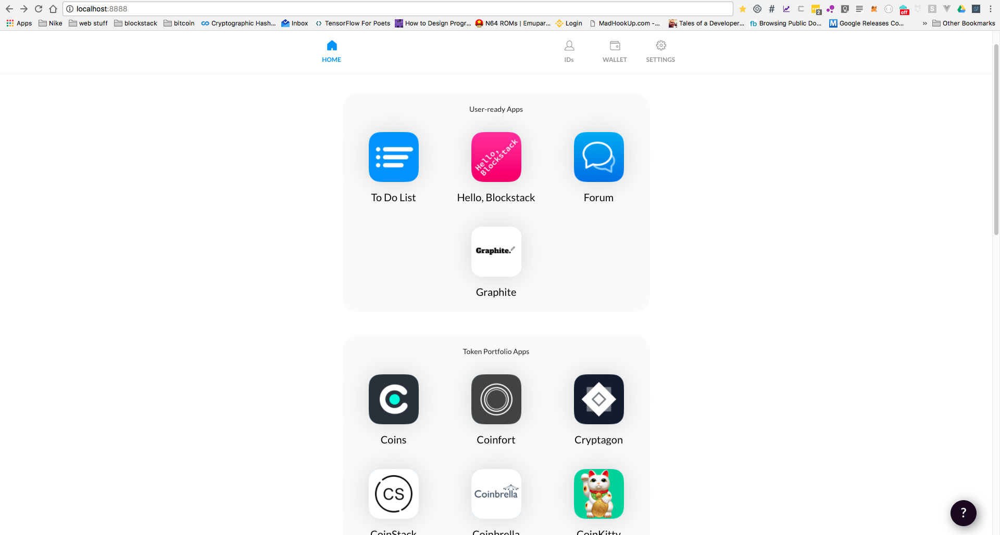

<section data-background="white">

#### cop-blockchain

Note:

</section>

---

<section data-background="#270f34">

## What Is Blockstack? ##

Note:
1) Blockstack is a new decentralized Internet where users own their data and apps run locally.

2) Blockstack is an open source development platform covers identity, storage, and decentralization.

3) Currently using the Bitcoin blockchain, but is blockchain agnostic.

</section>

---

<section data-background="#270f34">
## Blockstack Browser ##

Note:

1) What is the Blockstack Browser: a) an onramp to a new decentralized Internet, where your data is owned by you and your identity is owned by you. b) an app "store"

2) What we'll cover ... Walk through the install, review the home page where we'll first dive into IDs, Wallets, and Settings.  And then look at some applications

</section>

---

<section data-background="#270f34">
## Install ##

Note:
1) Install from https://blockstack.org/install

2) There is a Web-Only option, but it does not have full functionality

3) Windows version also does not have full functionality, but will very soon

4) Linux install requires installation of docker ahead of time.

</section>

---

<section data-background="#270f34">
## Walkthrough - Get Started ##

Note:
1) If you have an existing account or are moving to a new computer, you can use the "Restore an existing keychain" option

2) Show Restore dialog boxes

3) What is a KeyChain //TODO

4) Click Get Started

</section>

---

<section data-background="#270f34">
## Designed for Freedom & Security ##

Note:

1) As mentioned, you control your data

</section>

---

<section data-background="#270f34">
## Apps give you control of your data ##

Note:

1)

</section>

---

<section data-background="#270f34">
## Enter your email address ##

Note:

1) Not currently optional, but there is an open request to make it so

2) Used for communicating updates, name registration/transfer status, etc

</section>

---

<section data-background="#270f34">
## No 3rd Parties ##

Note:

1) your access to your data is managed by your keychain

2) save your passphrase! (next step) nobody at blockstack or anywhere can access/restore your data.  There is no support team if you lose your data.

</section>

---

<section data-background="#270f34">
## Create KeyChain ##

Note:

1) create a Password

</section>

---

<section data-background="#270f34">
## Write Down Your Keychain ##

Note:

1) Write it down. Save it.

</section>

---

<section data-background="#270f34">
## Verify Passphrase ##

Note:

1) I'm going to copy & paste here, but do NOT copy and paste.

2) Take the minute to write it down and then type it in

</section>

---

<section data-background="#270f34">
## Use Default Storage ##

Note:

1) Currently Gaia Hub is centrally managed by Blockstack

2) Instructions to run your own hub are online

3) Other storage providers are coming

</section>

---

<section data-background="#270f34">
## Home Page ##

Note:

1) Layout ... Apps, IDs, Wallet, Settings

</section>

---

<section data-background="#270f34">
## IDs ##

Note:

1) Complete Your ID/ Social Verification - use for sharing/social. Not needed for standalone use.

2) Add a username - requires Bitcoin to purchase.  Gives you Blockstack ID.

3) Any "Key" verification fields refer to your PUBLIC key. Never share your private keys.  That does not apply just to Blockstack, but is a good rule, in general, for anything.

4) Add a Full Name and Bio

5) Review Identity Address

</section>

---

<section data-background="#270f34">
## Wallet ##

Note:

1) Here! is your bitcoin address associated with your account or Blockstack id

</section>

---

<section data-background="#270f34">
## Settings ##

Note:

1) Storage Providers

2) Change Password

3) Backup Keychain

4) Reset browser

5) API Settings

</section>

---

<section data-background="#270f34">
## Apps! ##

Note:

1) Sign-in with Blockstack

2) ToDo

3) Graphite

4) Coins

</section>

---

<section data-background="#270f34">

## Find Us ##

* Slack - chat.blockstack.org
* Twitter - <i class="fa fa-twitter" aria-hidden="true"></i>@Blockstack
* GitHub - github.com/blockstack/
* Meetup - meetup.com/Blockstack-Portland

Note:

</section>
